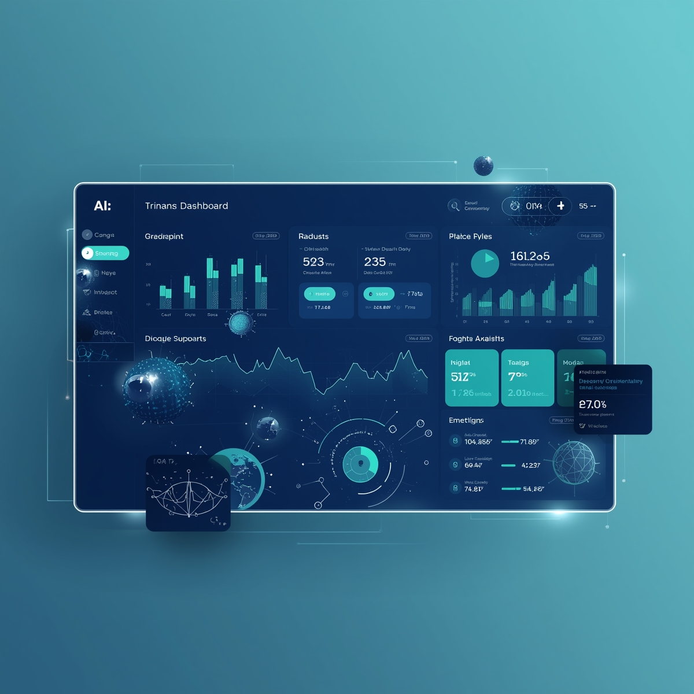

# AI-Powered Personal Finance Platform (WSU Finance)



## 📌 Project Abstract
This project is a comprehensive **Personal Finance Management System** designed to help users track expenses, manage budgets, and gain financial insights. Unlike traditional finance apps, this platform leverages **Artificial Intelligence (Google Gemini & Custom ML Models)** to automate receipt scanning and transaction categorization, significantly reducing manual data entry efforts. It features a responsive web interface and a native Android application, ensuring users can manage their finances from anywhere.

---

## 🚀 Key Objectives
1.  **Automation**: Eliminate manual data entry for transactions using OCR and ML.
2.  **Insight**: Provide clear, visual analytics of financial health (Income vs. Expenses).
3.  **Cross-Platform Access**: seamless experience on both Web and Mobile (Android).
4.  **Security**: Robust data protection using modern authentication and security protocols.

---

## 🛠️ Technology Stack

This project uses a modern, full-stack architecture to ensure scalability, performance, and security.

| Layer | Technology | Why it was chosen? |
| :--- | :--- | :--- |
| **Frontend (Web)** | **Next.js 15 (React)** | Server-Side Rendering (SSR) for performance, rich component ecosystem (Shadcn UI). |
| **Frontend (Mobile)** | **Android (Java/XML)** | Optimization for native mobile performance and hardware access. |
| **Backend (API)** | **Next.js Server Actions** | simplified typesafe backend logic directly within the Next.js framework. |
| **ML Service** | **Python (FastAPI)** | Python is the standard for ML; FastAPI is high-performance and easy to integrate. |
| **Database** | **SQLite (Dev) / PostgreSQL** | Robust relational database; accessed via **Prisma ORM** for type safety. |
| **Authentication** | **Clerk** | Secure, drop-in user management and authentication. |
| **AI/ML** | **Google Gemini AI** | State-of-the-art multimodal model for processing receipt images. |
| **AI/ML** | **Scikit-learn** | Used for custom transaction classification models (RandomForest/NaiveBayes). |
| **Job Queue** | **Inngest** | Handles background jobs (recurring transactions, email reports) reliably. |
| **Security** | **ArcJet** | Advanced rate limiting and bot protection. |
| **Styling** | **Tailwind CSS** | Utility-first CSS for rapid, responsive UI development. |

---

## ✨ Key Features

1.  **Smart Dashboard**: Real-time overview of total balance, income, expenses, and recent transactions.
2.  **AI Receipt Scanning**: Upload a receipt image, and the system extracts date, amount, merchant, and line items using Google Gemini.
3.  **Automatic Categorization**: Transactions are automatically classified (e.g., "Starbucks" -> "Food & Dining") using a Python-based Machine Learning model.
4.  **Recurring Transactions**: Set up monthly bills (rent, subscriptions) that are automatically processed.
5.  **Multi-Account Support**: Manage Checking, Savings, and Credit Card accounts in one place.
6.  **Secure Authentication**: Google Account and Email/Password login via Clerk.
7.  **Responsive Design**: Mobile-friendly web interface plus a dedicated Android app.

---

## 🏛️ System Architecture

1.  **User Client**: Interacts with the **Next.js Web App** or **Android App**.
2.  **API Layer**: 
    *   **Next.js Server Actions** handle core logic (CRUD for Transactions, Accounts).
    *   **FastAPI Service** exposes endpoints (`/predict`) for the ML classification model.
3.  **Database Layer**: Centralized **SQL Database** stores all user data.
4.  **External Services**:
    *   **Clerk**: Validates user sessions.
    *   **Google Gemini**: Processes images.
    *   **Resend Service**: Sends email notifications.

---

## 💻 Setup & Installation Guide

### Prerequisites
-   Node.js & npm
-   Python 3.8+
-   Android Studio (for mobile app)

### 1. Web Application (Next.js)
```bash
# Install dependencies
npm install

# Setup Environment Variables
# (See .env.example)

# Initialize Database
npx prisma generate
npx prisma db push

# Run Development Server
npm run dev
```
*Access the web app at `http://localhost:3000`*

### 2. ML Service (Python)
```bash
cd backend

# Create virtual environment
python -m venv venv
# Activate: venv\Scripts\activate (Windows) or source venv/bin/activate (Mac/Linux)

# Install requirements
pip install -r requirements.txt

# Start Server
npm run fastapi
# OR manually: uvicorn app.main:app --reload --port 8001
```

### 3. Android Application
1.  Open the `Android2` folder in **Android Studio**.
2.  Sync Gradle files.
3.  Run on an Emulator or Physical Device.
    *   *Note: Ensure the Android device is on the same network or use `adb reverse tcp:3000 tcp:3000` to access localhost.*

---

## 🎓 Project Defense Q&A (Examiner Prep)

**Q1: Why did you choose Next.js over separate React + Express?**
> **Answer:** Next.js provides a unified full-stack framework. It handles both frontend (React) and backend (Server Actions/API Routes) in a single project. This simplifies deployment, sharing of types (TypeScript), and state management. It also offers Server-Side Rendering (SSR) for better initial load performance and SEO compared to a client-side React app.

**Q2: How does the AI Receipt Scanner work?**
> **Answer:** When a user uploads a receipt, the image is encoded and sent to the **Google Gemini Pro Vision** API. We send a carefully crafted prompt asking the AI to analyze the image and return a JSON object containing the `amount`, `date`, `merchant_name`, and `description`. We then parse this JSON and populate the transaction form for the user to review.

**Q3: Explain the Machine Learning component.**
> **Answer:** We use a supervised learning approach. The Python service uses libraries like `scikit-learn` to train a model (e.g., Logistic Regression or Random Forest) on a labeled dataset of transaction descriptions and categories. When a new transaction is created, its description is vectorized (using TF-IDF or CountVectorizer) and passed to the model, which predicts the most likely category (e.g., "Uber" -> "Transportation").

**Q4: How do you handle security?**
> **Answer:**
> *   **Authentication:** We don't roll our own auth; we use **Clerk**, which handles session management, encryption, and secure logins (OAuth).
> *   **Authorization:** All database queries in Prisma are scoped to the `userId` to ensure users can only access their own data.
> *   **Protection:** We implemented **ArcJet** to protect API routes from bots and rate-limit abusive requests.
> *   **Validation:** We use **Zod** schemas to strictly validate all user inputs before processing.

**Q5: What was the biggest challenge you faced?**
> **Answer:** *[Suggestion] :* Integrating the Python ML service with the Next.js backend was challenging. Handling the asynchronous nature of network requests between the two services and ensuring that the Next.js app gracefully handles cases where the ML service might be offline required careful error handling and fallback logic.

**Q7: How did you implement Multi-Currency support and why did you use the Context API?**
> **Answer:** I implemented a `CurrencyContext` to provide a globally accessible financial state. I used the Context API because currency preference is a "cross-cutting concern"—it affects almost every component in the dashboard (Accounts, Transactions, Budgets). By using a Provider, I avoided "prop drilling" and ensured that changing the currency in one place instantly updates the formatting (via the `fmt` helper function) across the entire application.

**Q8: Explain your "Mobile-First" design strategy and the use of the `xs` breakpoint.**
> **Answer:** I followed a "Mobile-First" approach, meaning the default CSS classes are optimized for the smallest viewports (320px). I used Tailwind's responsive prefixes (like `xs:`, `sm:`, `md:`) to add complexity only as the screen grows. I defined a custom `xs` breakpoint (480px) because the gap between 320px (base) and 640px (default `sm`) is too large for financial data—this custom breakpoint allows for a smoother transition from vertical stacking to side-by-side grids.

**Q9: How are the Admin pages protected and why is it structured this way?**
> **Answer:** Protection is handled at two levels. First, the `middleware.js` uses a route matcher to ensure only authenticated users can access `/admin`. Second, the Server Components verify the user's role/permissions from the database before rendering. This layered approach ensures that even if a user bypasses the client-side UI, the server-side logic remains secure and private.

**Q10: What is the purpose of Inngest and ArcJet in this architecture?**
> **Answer:** 
> *   **Inngest:** Acts as our background job coordinator. It handles tasks that shouldn't block the UI, like generating monthly reports or processing recurring transactions with built-in retry logic.
> *   **ArcJet:** Provides a "Shield" for the application. It sits in the middleware to detect and block malicious bots, prevent SQL injection patterns, and implement rate limiting to ensure the API isn't abused or overwhelmed.

---

## 📈 Future Enhancements
- [ ] **Investment Tracking**: Integration with stock market APIs for portfolio management.
- [ ] **Voice Commands**: Utilizing Web Speech API for hands-free transaction logging.
- [ ] **Advanced AI Insights**: Predictive analysis of future spending patterns based on historical data.
- [ ] **Collaborative Budgeting**: Share accounts or budgets with family members.
